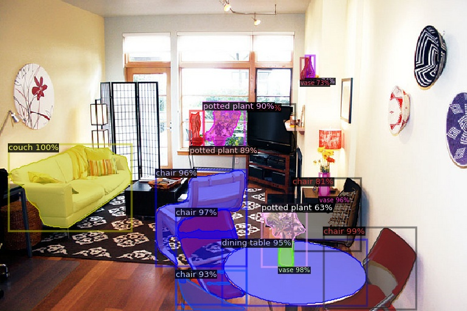

# MViT ReadMe

# Multi Scale Vision Transformer with cascade Mask-RCNN for Object Detection using Detectron2.

The code particularly uses MViT2 as a backbone. The features from the backbone are used by feature pyramid network for object detection. The code was executed using SBATCH file syntax. Source code is located in `src` directory of the repository.

## Installation

Install Detectron2 via pip package manager or local clone -

```
python -m pip install 'git+https://github.com/facebookresearch/detectron2.git'
# (add --user if you don't have permission)

# Or, to install it from a local clone:
git clone <https://github.com/facebookresearch/detectron2.git>

python -m pip install -e detectron2
```

**Inference using pre-trained model**

execute the sbatch file on the terminal

```
sbatch run.sbatch
```





```
@misc{wu2019detectron2,
  author =       {Yuxin Wu and Alexander Kirillov and Francisco Massa and

                  Wan-Yen Lo and Ross Girshick},
  title =        {Detectron2},
  howpublished = {\\url{<https://github.com/facebookresearch/detectron2>}},
  year =         {2019}
}

```